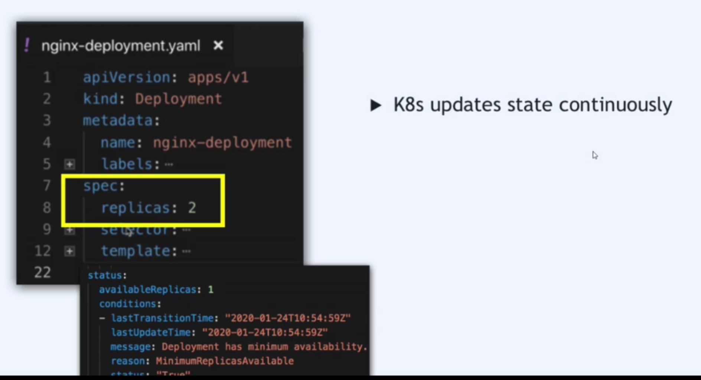

each configuration file has 3 parts

1.metadata

2.spec

3.apiVersion

4.kind

5.status (generatee automatically)
what does K8s get this status data?
(Etcd holds the current status of any K8s Component)

``

